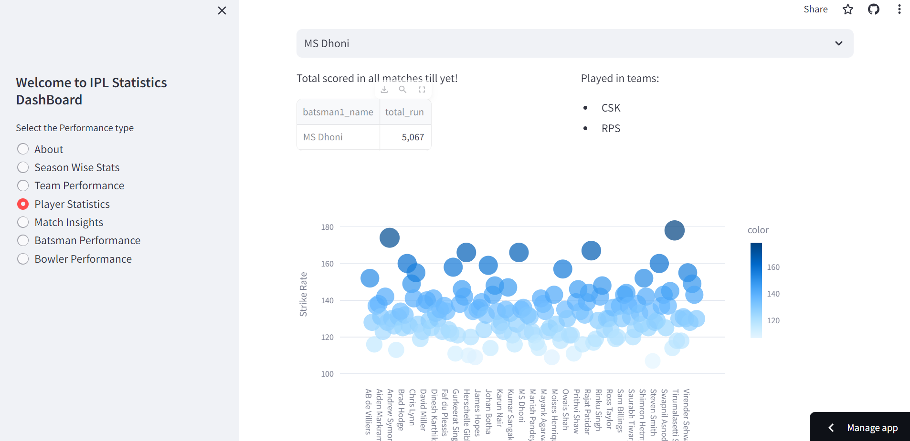

# IPL Data Science and Analysis Project WebApp

## About
Welcome to the IPL Data Science and Analysis Project! This project focuses on exploring and analyzing data related to the Indian Premier League (IPL), a premier professional Twenty20 cricket league in India. Our aim is to provide comprehensive insights into various aspects of IPL matches, teams, players, and more.

## Web App Screenshot


## 🚀 Features
- ***Data Cleaning:*** Dive into a meticulously cleaned dataset, ensuring accuracy and consistency in every analysis.
- ***Exploratory Data Analysis (EDA):*** Uncover fascinating insights through in-depth analysis of player performance, team statistics, and match outcomes.
- ***Interactive Streamlit Web Application:*** Experience the power of data visualization firsthand with our interactive Streamlit web application. Perform statistical calculations, visualize data trends, and discover key findings effortlessly.

## 🛠️ Technologies Used
- Python
- Pandas
- NumPy
- Matplotlib
- Seaborn
- Streamlit

## 📦 Installation
1. **Clone the Repository:** 
   ```bash
   git clone https://github.com/ish-g/Cricket_Analysis_IPL

## Modules

### 1. Season Wise Stats
Explore detailed statistics and insights on each IPL season. Dive into historical data to understand trends, team performances, player statistics, and more, season by season.

### 2. Team Performance
Analyze the performance of IPL teams across different seasons. Discover key metrics such as win-loss records, run rates, batting and bowling performances, and team rankings.

### 3. Player Statistics
Delve into the performance metrics of individual players in the IPL. Explore batting averages, strike rates, bowling economy rates, player rankings, and other crucial statistics.

### 4. Match Insights
Gain valuable insights into IPL matches. Analyze match outcomes, run rates, match-winning performances, memorable moments, and other highlights from past matches.

### 5. Batsman Performance
Explore the performance of batsmen in the IPL. Dive into batting statistics, centuries, half-centuries, boundary counts, and other metrics to assess the impact of batsmen on match outcomes.

### 6. Bowler Performance
Analyze the performance of bowlers in the IPL. Explore bowling statistics, wicket counts, economy rates, maiden overs, and other metrics to assess the effectiveness of bowlers in restricting opposing teams.

## Usage
### Install Dependencies:

[//]: # (   ```bash)
    pip install -r requirements.txt

### Navigate to the Project Directory:
[//]: # (   ```bash)
    cd ipl-data-analysis

### Run the Streamlit Web Application:
[//]: # (   ```bash)
    streamlit run app.py

### Access the Web Application:
Open your web browser and go to http://localhost:8501 to access the interactive Streamlit web application.

## 📊 Data
Discover a treasure trove of IPL data! Our dataset contains comprehensive information on IPL matches, player statistics, team performances, and more. Explore the data/ directory to uncover insights that redefine the game.

## 🤝 Contributing
We welcome contributions from fellow data enthusiasts! Whether it's bug fixes, feature enhancements, or new ideas, your input is valued. Feel free to open an issue or submit a pull request to contribute to this project.

## 📜 License
This project is licensed under the MIT License. See the LICENSE file for more details.

## 🙏 Acknowledgements
Special thanks to [DataSets](https://www.kaggle.com/datasets/patrickb1912/ipl-complete-dataset-20082020) for providing the IPL dataset used in this project.

## 📧 Contact
For any questions or inquiries about this project, please contact [Ishwar Gupta](mailto:ishwargupta4554@gmail.com).
